# 代码使用指南

# 1.代码简介

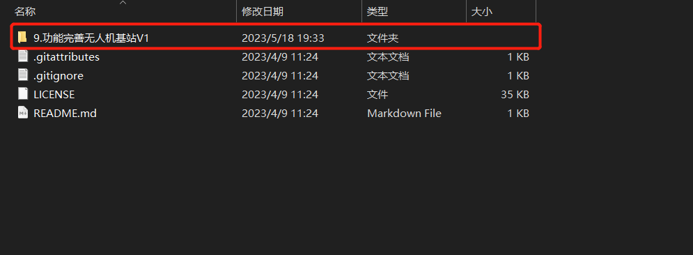

目前较稳定的代码版本是这一份，目前版本V1

## 1.1.实现功能

1.WiFi模块接入OneNET（这个功能往后可以拓展出很多的东西，比如：1.通过下发命令对基站进行控制，2.触发器(用于数据报警，当某个数据达到某个范围会发送相关的信息到你设定的邮箱中)，3.uniapp开发小程序，可以实现手机端的数据显示以及命令下发）	

2.RFID读卡器模块模块识别RFID标签

3.早期加的一些奇奇怪怪的传感器：DHT11温湿度传感器，BEEP蜂鸣器，SR501人体红外感应，TFTLCD

4.驱动电机实现的换电池流程（其实就是记住整个过程，像是工厂的流水线，不智能，触发方式是RFID读取到10次飞机脚上贴着的RFID标签）

# 2.代码讲解

别怪我没说啊，现在这份代码，问题有点多，首先就是改进已经有些难了，rtos啥的一般都需要占用一个串口，但这的串口几乎占满了，如果想改功能，可能得用更高级的芯片

关于怎么用这份代码，我会从功能角度切入，一步步和你们说怎么改代码，才能让它在你们手头上跑起来。

## 2.1.WiFi模块接入OneNET

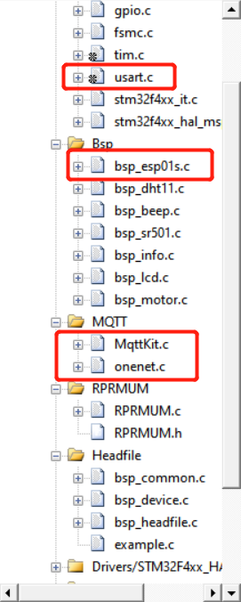

关于WiFi模块涉及到的东西就有点多了，首先是bsp_esp01s.c这个文件下，主要存放的是普通AT固件的eps01模块的AT指令驱动代码，也就是它的各种配置都通过单片机的串口发送AT指令给它，进而完成设置模式、接入用户热点、等操作。

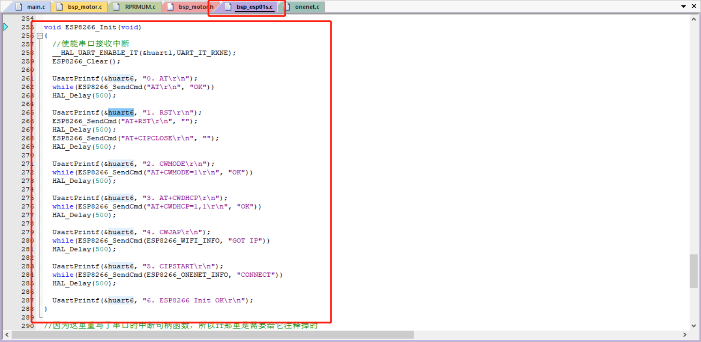

串口6是调试串口，其串口重定向也是弄好了，**那么要改的部分来了**：

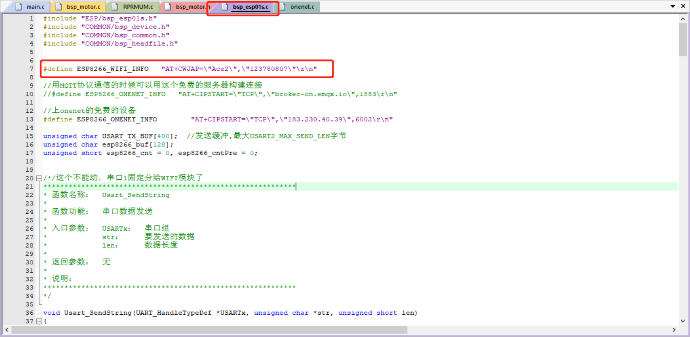

首先是**WiFi的ssid和password**，一看便懂，我就不细说了。

mqttKit.c没什么好说的，它是onenet写好的一些SDK，用于调用来编写你相应的API，而onenet.c就是存放API的文件。其中OneNet_FillBuf(char *buf)用于将数据流打包，打包格式是基本的json格式，这里就不多赘述

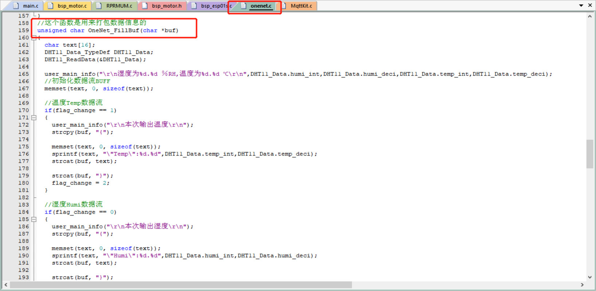

另外，onenet的命令下发的控制判断分支是：

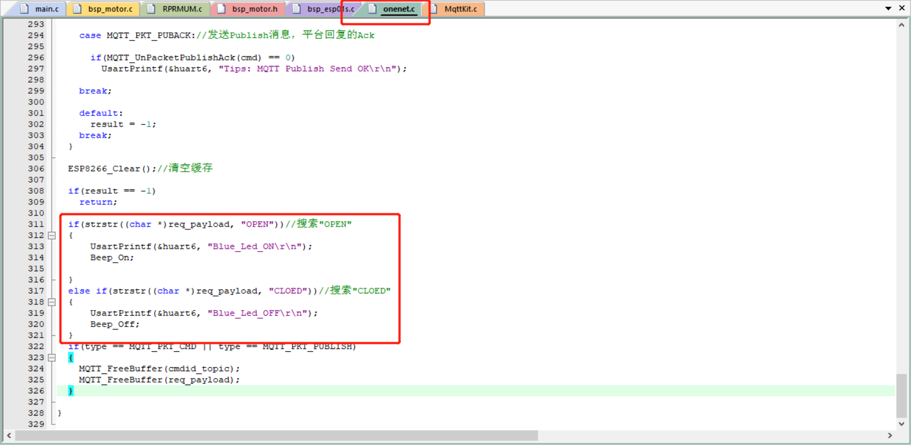

因为没啥能控制的，这里就只弄了个OPEN和CLOSE用来控制蜂鸣器的开关。

**注意了，onenet.c中要改的东西来了**：

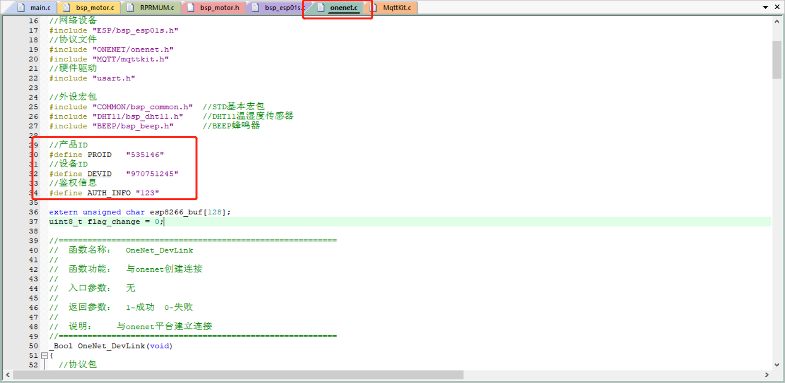

我这份代码**只适配**多协议接入中的**MQTT协议**其中PROID是产品ID，可以在产品概况的位置找到：

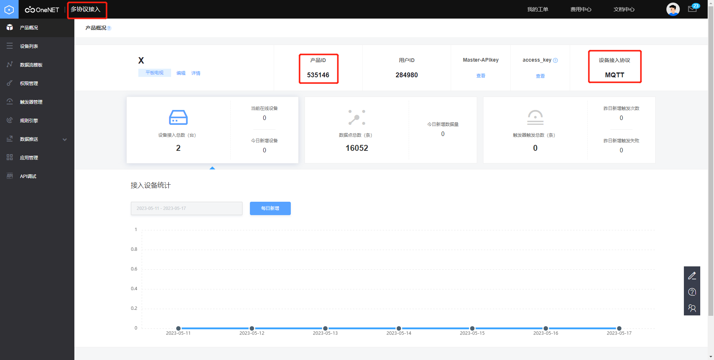

DEVID位置如下：

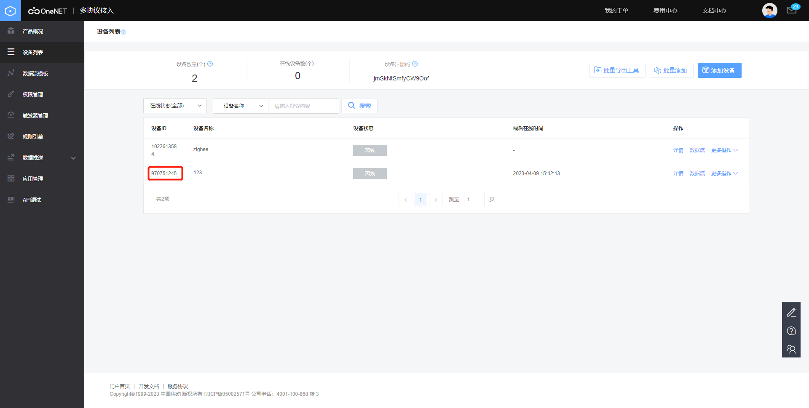

点击详情，可见AUTH_INFO位置如下：

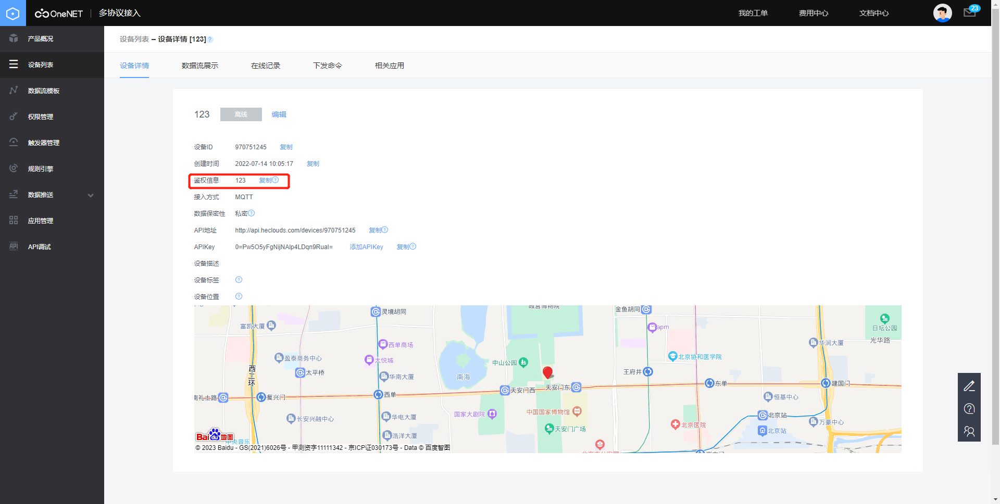

到此跑起来功能1，需要改的东西就这么多了。

## 2.2.RFID读卡器模块模块识别RFID标签

读卡器模块的代码有点多，但鉴于代码都有比较详细的注释，建议是自己看了，其中

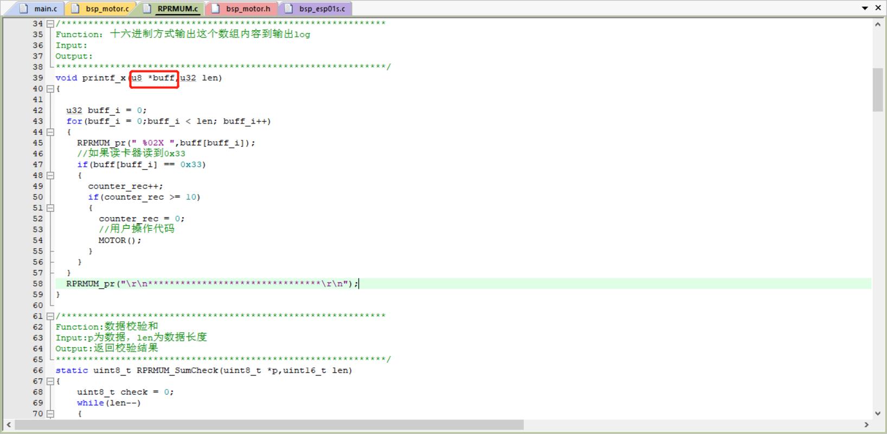

这段代码是遍历读卡器读取到的标签内的数据，并且将其通过串口打印出来，因为标签内的数据各个字段都有其各自的含义，这个得你们自己去了解标签内容了，在这里我给你们的那张标签内，有一个字段是0x33，所以在遍历到0x33时说明，该标签被读取，当读取到了10次这个标签，就运行功能四的电机归中流程，要注意的是，这里是没有一个代码运行后的标志位的，也就是当标签被识别第20次，MOTOR()又会被运行一次，那为什么不加标志位呢？如果加了标志位，当标志位置为运行后，那判断该标志位复位的分支判断该是什么？应该是无人机出站吧？但无人机出站的情况，无人机基站是无法获知的，后续可以考虑的一种解决方案是：当读卡器不再能够接收到无人机的标签数据，并且持续了3分钟，则把这个标签的标志位复位，但这又引入了一个新的问题，如果无人机离站后在3分钟内又回来了，这时标志位是运行后的状态，那么无人机就算在基站上电机也不会进行换电操作，可以说是又引入了一个新bug，按理讲这个读卡器能做到高速收费站的ETC的程度，其功能没完全开发出来，希望你们后续能够开发出读卡器能修改标签内的数据的操作，但好像也没啥用hhhh

## 2.3.早期加的一些奇奇怪怪的传感器

DHT11温湿度传感器，BEEP蜂鸣器，SR501人体红外感应，TFTLCD

因为这个设备的早期雏形是当时电赛做的一个疫情防控关闸，所以还有很多遗留的屎山代码，也不能说屎山代码吧，就是这个基站用不上，模块化的代码如下：

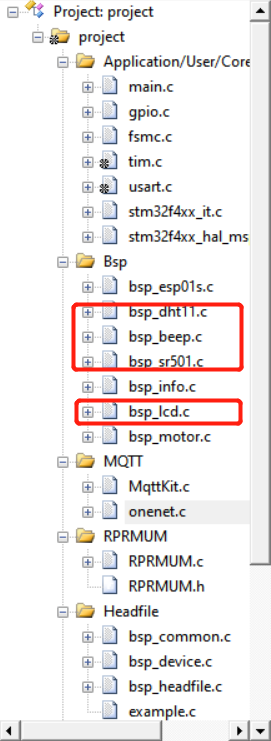

想用就用，TFT屏幕也留给你们了，理论上是可以直接用的。

## 2.4.驱动电机实现的换电池流程

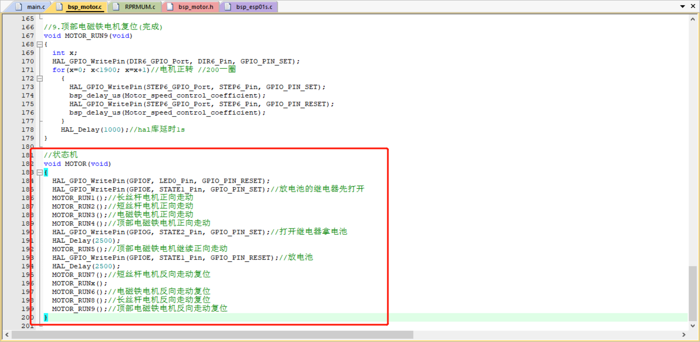

这个代码，自己看了都无语，最简单的单片机阻塞式写法，基本的状态机思路，单线程，运行这个，其他东西就全停了，参数其实也说的很清楚，在循环中步进电机转1圈，for循环要多循环200次

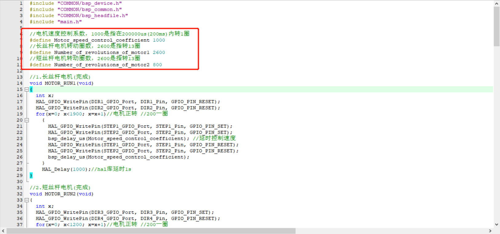

已经不想优化代码了，不把变量封装反而看起来还比较清爽，到此代码怎么用就结束了，希望你们后续对这个项目能够有更大的改进吧